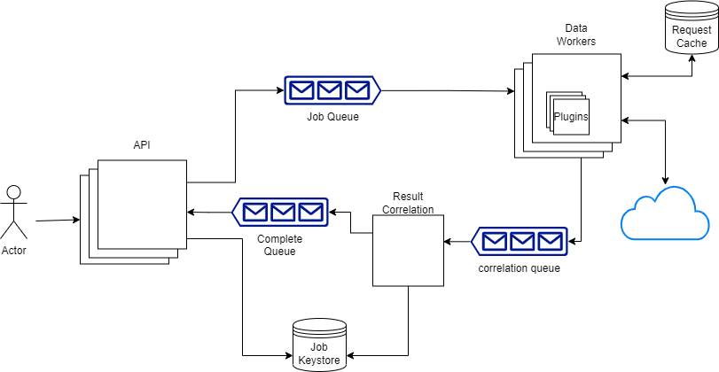

# Mercury
## _Sample Asynchronous Messaging API_


Mercury is a proof-of-concept correlation web service, designed to retrieve disperate information from multiple sources and return it to the requestor.


## Features

- Plugin model for extension
- Lightweight containered workers
- Abstracted persistence and messaging architecture
- Swashbuckle / Swagger for easy start
- Flexible return structure
- ✨Magic✨


## Tech
- [ASP.NET Core](https://docs.microsoft.com/en-us/aspnet/core/introduction-to-aspnet-core?view=aspnetcore-6.0) - .NET Core Web services and application lifecycle control
- [.NET CORE 6 LTS](https://dotnet.microsoft.com/en-us/platform/support/policy/dotnet-core) - Target Framework
- [xUnit](https://xunit.net) - Unit Testing Framework
- [Docker](https://docker.io) - Develop with containers
- [Redis](https://redis.io/) - In-Memory Data Store for database and cache
- [RabbitMQ](https://rabbitmq.com) - Open source message-broker


## To run
Place a .env file with MQ_USERNAME and MQ_PASSWORD. API Keys for plugins may also be placed here and in docker-compose.yml
Then:
```docker compose up```

URLS Available:
- http://localhost:8888/swagger/index.html - Main API
- http://localhost:15672/#/ - RabbitMQ UI
- http://localhost:8881/ - REDIS UI

## Plugins

Currenlty extended with:
- GeoIP - https://ipdata.co
- Virus Total - https://develops.virustotal.com

After developing a new plugin:
- Add to JobWorker Dockerfile
- Add Name to Allowed services in the API appsettings.json
- Add any environment key to docker-compose.yml and your .env file


## Why
Skills were getting rusty, and it's good to stretch one's legs. This was practice for me in a more-than-trivial project in a technology stack I was familiar with, but haven't worked with in a few years.


## Project Structure

# API


## Concept


## AWS Deployment


## License

MIT
**Free Software!**
